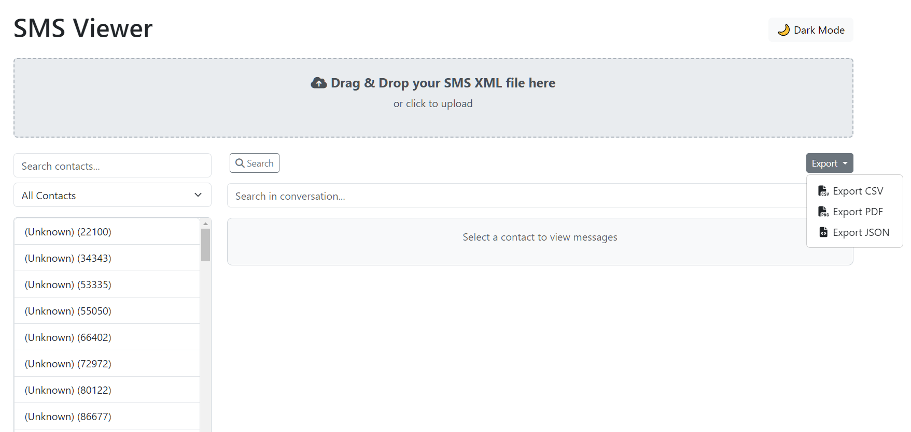
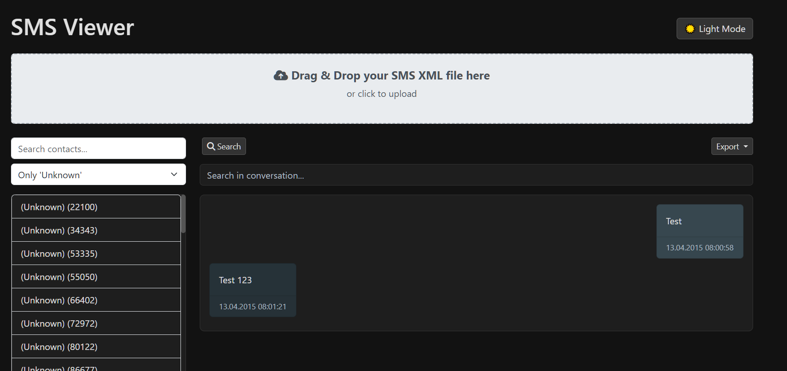

# **SMS Viewer and Exporter**

A web-based application to parse, view, and manage SMS backup files (XML format) from the "SMS Backup & Restore"-App (not affiliated or connected with the developer) with advanced features like phone number normalization, contact filtering, and conversation export.

---

## **Features**

### **1. Phone Number Normalization**
- Automatically removes international and local prefixes, ensuring all phone numbers are formatted uniformly.
- Prevents duplicate contacts caused by formatting inconsistencies (e.g., `+49`, `0049`, `0176`).

### **2. SMS Parsing**
- Processes XML files containing SMS backup data.
- Groups messages by normalized phone numbers for consolidated conversations.
- Extracts key details like timestamps, message content, and type (sent/received).

### **3. Contact Management**
- Displays a scrollable, searchable list of unique contacts.
- Dynamic filters to show all contacts, named contacts, or unknown numbers.

### **4. Chat View**
- Clean, organized chat window to display conversations for selected contacts.
- Differentiates between sent and received messages.

### **5. Export Options**
- Export conversations in multiple formats:
  - **CSV**: For spreadsheets.
  - **JSON**: Machine-readable structured data.
  - **PDF**: Printable format for archiving.

### **6. User-Friendly Design**
- Drag-and-drop support for XML uploads.
- Dynamic search and filter functionality for contacts and messages.
- Light and dark mode options for accessibility.

---

## **Built With**

- **HTML5**: For the structure of the application.
- **CSS3** (Bootstrap): For responsive and modern UI design.
- **JavaScript**: For dynamic functionality and XML processing.
- **[jsPDF](https://github.com/parallax/jsPDF)**: To generate PDF exports.
- **Bootstrap v5.x**: For styling and layout.
- **[Font Awesome](https://fontawesome.com/)**: For icons used in the UI (optional).

---

## **Getting Started**

### **Prerequisites**
- A modern web browser (e.g., Chrome, Firefox, Edge).

### **Setup**
1. Clone the repository:
   ```bash
   git clone https://github.com/your-username/sms-viewer.git
   cd sms-viewer
   ```
2. Open `index.html` in your browser.

---

## **Usage**

1. Drag and drop your SMS backup XML file into the upload area.
2. Browse contacts and select a conversation to view messages.
3. Use filters or search to find specific contacts or messages.
4. Export conversations in your desired format (CSV, JSON, or PDF).

---

## **External Dependencies**

This application relies on the following external libraries:
- **[jsPDF](https://github.com/parallax/jsPDF)**: For generating PDF exports.
- **[Bootstrap](https://getbootstrap.com/)**: For responsive and modern UI.
- **[Font Awesome](https://fontawesome.com/)**: For icons used in the UI (optional, if added).

To install dependencies locally, ensure you include these via a CDN in the `index.html` file or download them into the project.

---

## **Screenshots**

### **Main Interface**


### **Dark Mode**


---

## **Contributing**

We welcome contributions to improve the project! Here's how you can help:
1. Fork the repository.
2. Create a feature branch:
   ```bash
   git checkout -b feature-name
   ```
3. Commit your changes:
   ```bash
   git commit -m "Add feature-name"
   ```
4. Push to your branch:
   ```bash
   git push origin feature-name
   ```
5. Open a pull request.

---

## **License**

This project is licensed under the MIT License. See the [LICENSE](LICENSE) file for details.

---

## **Acknowledgments**

- Built with support from **OpenAI ChatGPT**.
- Inspired by the need to manage SMS backups more effectively.